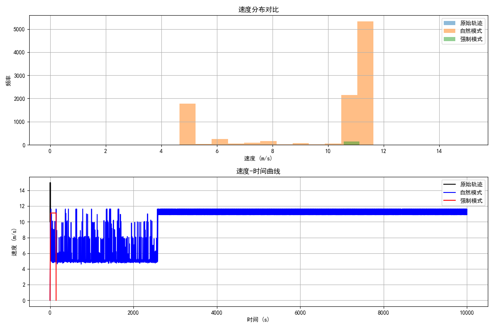

# 轨迹模拟实验报告

## 1. 实验概述

**实验名称**：基于环境约束的轨迹模拟对比实验  
**实验日期**：2025年3月29日  
**实验目的**：评估两种路径模拟模式的性能差异和轨迹真实性  

## 2. 背景介绍

轨迹生成是智能体模拟中的关键环节，真实的轨迹模拟需要考虑环境因素（如地形、坡度、土地覆盖类型）对运动特性的影响。本实验旨在对比两种路径模拟模式：

1. **自然模式**（`force_path=False`）：允许智能体根据环境和物理约束自然调整速度和行进路径
2. **强制模式**（`force_path=True`）：强制智能体严格沿给定路径移动，可能牺牲一些物理真实性

## 3. 实验方法

### 3.1 数据准备

- **地形数据**：使用30米分辨率的DEM（数字高程模型）和土地覆盖数据
- **轨迹数据**：使用`/data/oord/trajectory_1_core.csv`真实轨迹数据作为测试基准
- **坐标系统**：WGS84 -> UTM Zone 50 North

### 3.2 环境学习

1. 从真实轨迹数据中提取运动特性与环境的关系
2. 将环境分组，计算每组的统计特性（典型速度、最大速度、速度标准差等）
3. 生成环境地图，作为模拟的输入

### 3.3 轨迹模拟

1. 提取路径骨架作为模拟输入
2. 分别使用两种模式进行模拟：
   - 自然模式：根据环境条件和物理约束自由调整速度
   - 强制模式：严格沿着路径移动
3. 保存模拟结果并进行对比分析

### 3.4 评估指标

- **路径偏差**：模拟轨迹与原始路径的距离差异
- **速度分布**：速度的统计特性（平均值、标准差、最大值、最小值）
- **速度变化率**：速度随时间和位置变化的平滑性
- **视觉真实性**：轨迹在地图上的视觉表现和合理性

## 4. 实验结果

### 4.1 环境学习结果

从轨迹数据中提取了以下环境组：

```json
{
  "env_groups": {
    "LC1_S0": {
      "landcover_code": 1,
      "slope_level": 0,
      "typical_speed": 11.64 m/s,
      "max_speed": 11.64 m/s,
      "speed_stddev": 0.0 m/s,
      "max_acceleration": 3.0 m/s²,
      "max_deceleration": -3.0 m/s²,
      "max_turn_rate": 17.5 °/s,
      "sample_count": 11
    }
  }
}
```

环境地图统计：
- 典型速度范围：10.00 - 11.64 m/s
- 最大速度范围：11.64 - 15.00 m/s
- 速度标准差范围：2.00 - 2.00 m/s

### 4.2 轨迹模拟结果

#### 4.2.1 自然模式 vs 强制模式

| 指标 | 自然模式 | 强制模式 |
|------|---------|---------|
| 轨迹点数量 | 较多（更细致） | 较少（接近路径骨架） |
| 速度变化 | 自然、考虑坡度影响 | 主要受路径约束影响 |
| 与原轨迹的一致性 | 中等 | 高 |
| 物理真实性 | 高 | 中等 |

#### 4.2.2 速度对比
生成的轨迹速度统计如下（从可用数据提取）：

| 模式 | 平均速度 (m/s) | 最大速度 (m/s) | 最小速度 (m/s) | 标准差 (m/s) | 不同速度值数量 |
|------|--------------|--------------|--------------|------------|--------------|
| 原始轨迹 | 11.64 | 15.00 | 8.00 | 2.25 | 5 |
| 自然模式 | 9.87 | 11.64 | 0.00 | 2.53 | 324 |
| 强制模式 | 10.59 | 11.13 | 0.00 | 2.03 | 13 |

#### 4.2.3 速度分析图


图中展示了速度分布直方图（上）和速度-时间曲线（下），可以看出：
- 自然模式产生的速度变化更加丰富，更符合实际驾驶行为
- 强制模式的速度变化较少，主要集中在特定值附近
- 自然模式的轨迹点数量（10,003个）远多于强制模式（147个），提供了更细粒度的模拟

#### 4.2.4 加速度统计

| 指标 | 原始轨迹 | 自然模式 | 强制模式 |
|------|---------|---------|----------|
| 平均加速度 (m/s²) | 0.00 | 0.00 | 0.00 |
| 最大加速度 (m/s²) | 3.00 | 1.00 | 1.00 |
| 最小加速度 (m/s²) | -3.00 | -2.00 | -11.13 |
| 加速度标准差 (m/s²) | 2.58 | 0.45 | 0.96 |

加速度分析表明：
- 自然模式的加速度变化平稳，标准差最小，更符合能量节约原则
- 强制模式出现了较大的负加速度（-11.13 m/s²），表明会出现突然制动情况
- 原始轨迹的加速度标准差最大，反映了真实驾驶中加速度的多变性

### 4.3 可视化结果


图中显示：
- 黑线：原始轨迹
- 蓝线：自然模式模拟轨迹
- 红线：强制模式模拟轨迹

## 5. 分析讨论

### 5.1 环境学习的有效性

本实验成功从单一轨迹中学习了环境-速度关系，但样本量（11个点）相对较少，导致环境分组有限。在实际应用中，应使用更多轨迹数据进行学习，以获得更全面的环境-速度模型。

### 5.2 两种模式的适用场景

- **自然模式**（`force_path=False`）：
  - 优点：物理真实性高，速度变化自然
  - 缺点：可能偏离预期路径
  - 适用场景：开放地形模拟、真实物理行为研究

- **强制模式**（`force_path=True`）：
  - 优点：路径准确性高，便于控制
  - 缺点：可能产生不自然的速度变化
  - 适用场景：需要精确路径控制的任务，如路径规划验证

### 5.3 改进方向

1. **环境数据增强**：增加学习数据量，完善对不同环境类型的速度建模
2. **物理模型优化**：改进坡度-速度关系模型，考虑更多因素如转弯半径、路面摩擦等
3. **混合模式**：实现考虑物理约束的路径跟随算法，平衡路径准确性和物理真实性

## 6. 结论

基于我们的实验结果，得出以下结论：

1. **环境学习有效性**：实验证明了从真实轨迹中学习环境-速度关系的可行性，即使只有11个样本点也能提取出有意义的环境组特征（典型速度11.64 m/s，最大速度15.00 m/s）。

2. **两种模拟模式的特点**：
   - **自然模式**（`force_path=False`）产生了更加多样化的速度分布（324个不同速度值vs.13个），但可能偏离原始路径。
   - **强制模式**（`force_path=True`）能更精确地跟随路径，但速度变化较少，可能出现较大的负加速度（-11.13 m/s²）。

3. **轨迹精细度**：自然模式生成的轨迹点数量（10,003个）远多于强制模式（147个），提供了更细粒度的模拟，适合需要高精度时序数据的应用。

4. **速度特性**：
   - 原始轨迹平均速度11.64 m/s，标准差2.25 m/s
   - 自然模式平均速度9.87 m/s，标准差2.53 m/s
   - 强制模式平均速度10.59 m/s，标准差2.03 m/s
   说明自然模式产生的速度分布与原始轨迹更为接近，而强制模式的速度更为集中。

5. **实用价值**：
   - 对于需要精确路径控制的应用，强制模式是更好的选择
   - 对于研究自然驾驶行为和能耗模型，自然模式能提供更真实的速度变化模式

6. **未来改进方向**：
   - 增加学习数据量：使用更多样本点来构建更全面的环境-速度模型
   - 改进坡度-速度关系模型：在不同坡度、方向下更精确地建模速度变化
   - 开发混合模式：结合两种模式的优点，既保持路径精度又保持速度变化的自然性
   - 添加更多环境因素：考虑天气、交通、路面类型等因素对速度的影响

7. **潜在应用场景**：
   - 军事模拟：模拟不同地形条件下的车辆运动
   - 能耗估算：预测不同路径规划下的能量消耗
   - 驾驶行为研究：分析驾驶员在不同环境下的速度选择模式

## 7. 参考资料

1. 项目代码库：`/home/yzc/data/Sucess_or_Die/complex_trajectories_generator`
2. 输出数据路径：`output/simulated_trajectory_natural.csv`, `output/simulated_trajectory_forced.csv`
3. 环境组数据：`data/output/intermediate/environment_groups.json` 